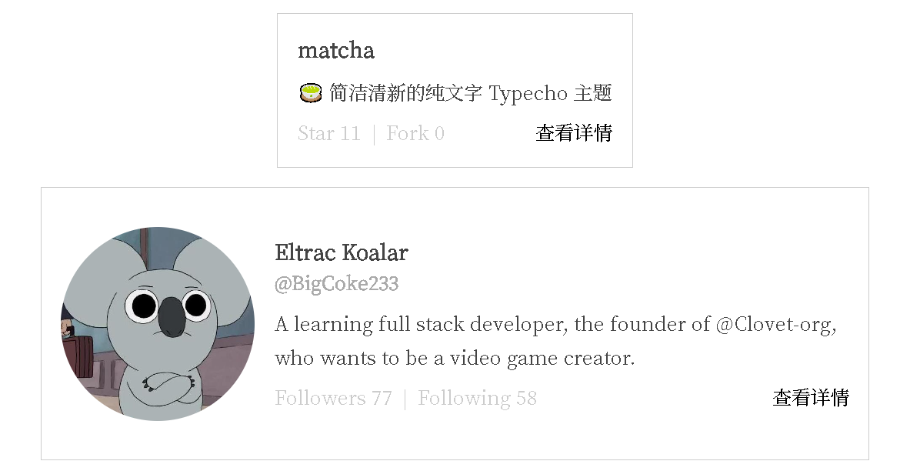

# BracketDown Plugin for Typecho

BracketDown 是一个适用于 Typecho 的 Markdown 语法拓展插件，加入了一系列短代码，方便博主在编写文章时更好地排版。

## 使用

1. 下载仓库 `main` 分支中的文件，或者使用 `git clone`
2. 将插件目录重命名为 `BracketDown`（注意大小写）
3. 将插件文件夹放置于 typecho 安装目录下的 `/usr/plugins/` 目录
4. 在 Typecho 后台启用插件
5. 按照设置界面的提示配置插件

Enjoy~

## 注意事项

Typecho 原生的代码块内不能出现 BracketDown 的语法代码，它们会被照常解析，这样往往会打乱你的排版，让文章变得很奇怪。
只有你真的要使用相应的功能时才可以输入这些代码。

~~同时，请避免在文章中出现额外的 `[]` `[` `]`，这会更加严重的打乱你的排版，目前暂时无法修复，总之，如果不使用短代码就不要输入中括号！~~
这个问题已被修复，但仍然需要避免使用中括号。

## 语法

这里将详细介绍 BracketDown 插件拓展的语法

### 文字块（Block）

文字块用于让一部分文段以更加显眼的方式展示出来，默认样式的文字块是一个有淡灰色边框和浅灰色背景的盒子。
通常情况下文字块用于标记正文中较为重要的额外信息，很多时候博主会用块引用（Blockquote）来完成同样的事情，即使那些文本并非是引用，在这样的情况下，文字块是比块引用更好的选择。

你可以这样创建一个文字块。

```
[block]你要标记的文段。[/block]
```

### 下拉框（Details）

顾名思义，下拉框语法可以创造一个默认只显示标题，点击后就会展示详细内容，再次点击则会收起的结构，用于书写一些不那么重要但可以用于参考的信息。
BracketDown 的下拉框使用的是 HTML 原生的 `<details>` 标签，这个特性比较新，所以插件引入了相应的垫片来提高其兼容性。

你可以这样创建一个下拉框。

```
[details sum="默认显示的标题"]点击后展开的内容[/details]
```

or

```
[details]
[summary]默认显示的标题[/summary]
点击后展开的内容
[/details]
```

推荐使用第一种方法。

### 文章卡片（Art）

> 该功能的灵感即短代码语法来自于 [youranreus/G](https://github.com/youranreus/G)

当你需要在你的一篇文章里提及另一篇文章，并引导读者阅读，可以使用文章卡片。

```
[art]cid[/art]
```

其中，`cid` 表示 Typecho 文章的标识符，每篇文章都有自己独一无二的 cid，可以到后台查看，具体方法为：管理-文章-点击一篇文章进行编辑-查看浏览器地址栏最后的数字

### 链接解析（Link to Content）

> 此功能可以在插件设置中开启/关闭

如果你在文章中直接输入一个链接，而不使用 MD 语法（如 `[名字](链接)`），就像这样：

```
https://github.com/BigCoke233/typecho-plugin-BracketDown
```

它就会被插件识别，如果它指向的是插件支持的平台，它就会被转化为特定的格式，如：

- GitHub：指向仓库或用户页面的链接会以卡片展示内容

- Bilibili：指向视频页面的链接会被解析为视频插入到文章中（代码参考 [superLink 插件](https://github.com/ShangJixin/Typecho-Plugin-superLink/)）

<details>
<summary>关于 Pjax</summary>

如果你的主题使用了 pjax，你可能需要设置回调函数才能正常使用这个功能。

```javascript
if($('[data-github]').length) { BracketDown.core() }
```

</details>


### 文字上色（TextColor）

有些时候我们可能会想要给一段文字加上背景色或者改变它的颜色，用于强调或者装饰，可以这样写。

```
&{被上色的文字|颜色|背景色}
```

如果只想要更改文字颜色和背景色其中的一个，则可以这样写。

```
&{被上色的文字|颜色}
#{被上色的文字|背景色}
```

其中，颜色和背景色都可以用 css 中能够使用的方式表示颜色，例如：英文单词（red/yellow/white...）、十六进制颜色代码（#000/#66ccff/#fefefe...）、RGB 值（rgb(0,0,0)/rgba(0,0,0,1)...）等。

### 下划线

可以用以下语法给一段文字添加下划线，默认样式为 `text-decoration: underline`。

```
?画线的句子?
```

### 注音

遇到一些生僻字~~或者纯粹想要调皮一下~~的时候，可能会需要给文字注音。

```
{{文字:拼音}}
```

### 键盘按键

在表示键盘上的按键，如 `ctrl`、`tab` 等，可以使用以下语法，创建一个外观与按键类似的小框。

```
[[键盘按键]]
```

